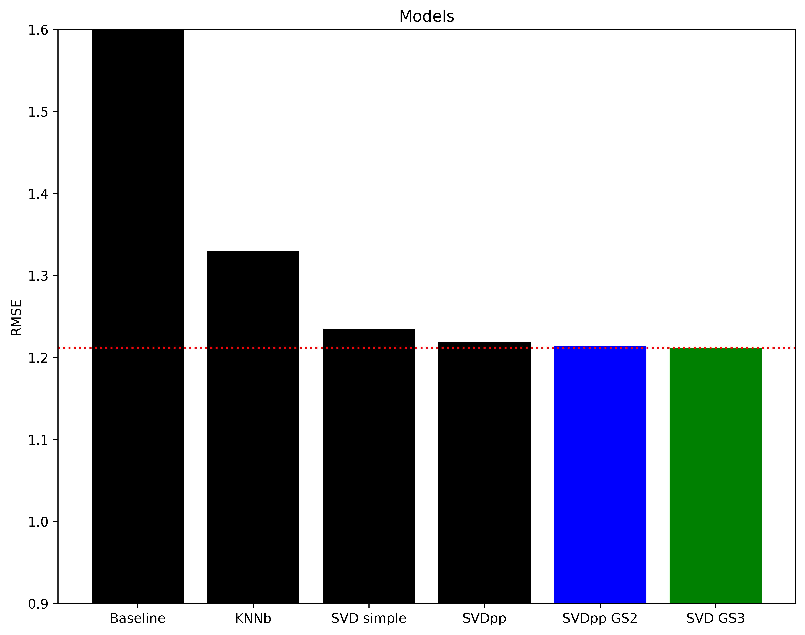

**Author: Juan Acosta**

***
## Motivation
In 2022, over 1,100 games were released, and this number doesn't even include indie developer games. The total number of games available has reached millions, making it increasingly difficult for players to discover new titles. To address this problem, a project was initiated using data from 140,000 game reviews. Utilizing the Surprise package in Python, the machine learning model created through this project achieved an RMSE of 1.20. This means that the model is able to predict the star rating (out of 5) for a given game and user within a margin of 1 star
***

## Business understanding
[Polygon](Polygon.com) is a well-known video game website and blog that was founded in 2012 and has been recognized as one of PC Magazine's top 100 classic web sites. Polygon describes itself as a news and opinion site about games and topics that are important to serious gamers, and strives to be an inclusive platform for gamers of all ethnicities, genders, and sexual orientations. The site expects its writers and commenters to treat the people they write about with respect, as they would if they were to meet them in person. Polygon aims to provide a welcoming and respectful community for gamers of all backgrounds.

While Polygon does not currently offers a personalized recommendation system on their site, users who are looking for new games may have to rely on recommendations based on general popularity and marketing rather than their own personal interests and experiences. With so many games available on the market, it can be overwhelming for players to go through all of the options and find something that suits their interests. A recommendation system can be really useful for players when it comes to finding new titles that align with their preferences and past behavior.

One potential problem with using recommender systems on official platform stores for digital games is that they may prioritize promoting newer, more profitable games, potentially at the expense of recommending older but high-quality ones. This can lead to customers missing out on discovering older games that they might enjoy. It's important to be aware of this potential bias and to consider using other sources of recommendations besides the official stores. This can help ensure that customers are exposed to a wide variety of games, including older titles that may not be as prominently featured.

In recent years, the video game industry has experienced a significant shift towards digital sales, with the majority of global revenue coming from digital channels. In 2022, it is estimated that over 75% of global video game revenue was generated through digital sales ([source](https://www.pushsquare.com/news/2022/07/nearly-80percent-of-all-ps5-ps4-games-are-bought-digitally)), indicating a strong trend towards online purchasing and digital distribution of games. This shift is likely driven by several factors, such as the increasing prevalence of high-speed internet and the convenience of being able to purchase and download games directly to a device without the need for physical copies. As digital sales continue to increase in importance, recommendation systems will become increasingly important for gamers. Polygon, as a site that values its audience, could benefit from offering a recommendation system to help its users. This could not only benefit the site's visitors, but it could also help Polygon retain website traffic by providing a useful and unique feature that keeps users coming back.
***

## Data undestanding and Preparation
To build a recommendation system, I used a dataset containing over 140,000 reviews from approximately 112,000 customers and more than 7,000 different video-game items. It was collected from Amazon, and all reviews use the 1-5 starts rating system. The time frame of the dataset ranges from 2006 to 2015.

To prepare the dataset, I used the pandas library in Python to perform initial exploration and cleaning. This included dropping any non-game items such as subscription services, DLCs and virtual currency. After that, i grouped items by name by deleting any unnecessary substrings. I then loaded the necessary features, this included `customer_id`, `game_title` and `rating`, into a new format for use with the surprise library, and performed a train-test split to prepare the data for modeling.

You can find the dataset i used on kaggle [here](https://www.kaggle.com/datasets/cynthiarempel/amazon-us-customer-reviews-dataset?select=amazon_reviews_us_Digital_Video_Games_v1_00.tsv)

#### Columns
- **marketplace**: 2 letter country code of the marketplace where the review was written.
- **customer_id**: Random identifier that can be used to aggregate reviews written by a single author.
- **review_id**: The unique ID of the review.
- **productid**: The unique Product ID the review pertains to. In the multilingual dataset the reviews for the same product in different countries can be grouped by the same productid.
- **product_parent**: Random identifier that can be used to aggregate reviews for the same product.
- **product_title**: Title of the product.
- **product_category**: Broad product category that can be used to group reviews (also used to group the dataset into coherent parts).
- **star_rating**: The 1-5 star rating of the review.
- **helpful_votes**: Number of helpful votes.
- **total_votes**: Number of total votes the review received.
- **vine**: Review was written as part of the Vine program.
- **verified_purchase**: The review is on a verified purchase.
- **review_headline**: The title of the review.
- **review_body**: The review text.
- **review_date**: The date the review was written.
***

## Modeling
To build the recommendation system, I deployed the scikit-surprise library in Python, which offers a range of algorithms for creating recommendation models. In this case, I utilized collaborative filtering techniques to generate recommendations based on user-item interactions. This involves using machine learning to uncover the underlying patterns in the data and make predictions. To optimize the model, I  performed multiple grid-searches to find the best set of hyperparameters and evaluated the performance of the model using the root mean squared error. A small RMSE value indicates that the model's predictions are close to the actual ratings(the true values), while a large RMSE value indicates that the predictions are far from the truth. I also included the mean absolute error (MAE) to observe the average differance between prediction and true rating, but all decisions were made based only on RMSE results.
***

## Evaluation
To evaluate the performance of different models, I used the RMSE as the metric of choice. After analyzing the results, i found that the SVD model with hyperparameters from the third grid search achieved the best performance, with an RMSE of 1.2118. This value is lower than the RMSE of 1.7792 produced by the baseline model, indicating a significant improvement.



While SVD++ models also demonstrated an improvement compared to the baseline model, it should be noted that they are more computationally expensive as demonstrated by the cross validation results.


***

## App demo
I used streamlit to adapt the function for use in a recommendation app so I could see how a user might interact with it. Streamlit is a Python library that helps you build interactive web-based applications.

[Video Demo](https://vimeo.com/785099791) hosted on vimeo

[](https://vimeo.com/785099791)

***

# Conclusion
The SVD model can make recommendations for games that a user has not played yet by using their past behavior and the rating history of similar users. It can predict the ratings of these games and recommend the ones that are most likely to be highly rated. Polygon, a gaming website that is not directly involved in game development, can benefit from implementing this system by offering personalized recommendations to its audience without any outside advertising influence. Polygon's dedication to creating a positive experience for gamers and its desire to continually improve its site drives the decision to implement such a system, which also has the added benefit of increasing website traffic and engagement.

**limitations**<br>
A major drawback of collaborative filtering is its reliance on the quantity of user feedback, i narrowed the dataset by only including users who had provided more than 5 reviews, this reduced the number of game titles by nearly 50%, but I was still left with 3000 games to use in the model. While this approach did lead to a lower RMSE, the recommendations for almost all users tended to be the same, this could be due to the sparsity in the data when there are few ratings relative to the total number of items. In these cases, it can be difficult to identify similar users and make reliable recommendations. One way to address this issue is to increase the amount of data available. Another approach is to implement a content-based recommendation model, which makes recommendations based on the similarity of items rather than user behavior. This can lead to more diverse recommendations and may also help to solve the "cold start" problem, where a lack of data makes it difficult to generate reliable recommendations for new users. A content-based model does not rely on user feedback such as ratings, so it can provide recommendations even when data is limited.

**Next steps**<br>
One potential next step to improve the recommendation system would be to implement a content-based approach using game genres, platform, and developer information as features for the model. This would allow the system to recommend similar games based on the characteristics of games that a user has already played. Another option to consider is using NLP on the review text provided by customers to incorporate additional insights into the model, this could provide a more personalized recommendation experience for users.

***

## Citations and Resourses

* #### [Surprise Documentation](https://surprise.readthedocs.io/en/stable/)

* #### [Daniel Burdeno - Kindle-eBook-Recommendations](https://github.com/danielburdeno/Kindle-eBook-Recommendations)

* #### [Mate Pocs - Memory-Based Recommendation Systems](https://towardsdatascience.com/how-to-build-a-memory-based-recommendation-system-using-python-surprise-55f3257b2cf4)

* #### [Neil Chandarana - SVD: Where Model Tuning Goes Wrong](https://towardsdatascience.com/svd-where-model-tuning-goes-wrong-61c269402919)

* #### [Simon Funk jornal about SVD](https://sifter.org/~simon/journal/20061211.html)

* #### **Cover image** :Logo from [Polygon](https://Polygon.com/), background from [Nintendo](https://www.nintendo.com/)


## Repository Structure
```
├── Model                             <- Saved model used for app
├── Data                              <- Datasets, raw data = Digital_Video_Games.tsv, cleaned = GameRatings.csv.
├── images                            <- Images and graphs used on the notebook, README and App file.
├── .gitignore                        <- Rules to ignore by Github.
├── README.md                         <- This file.
├── Game_recommender_system.ipynb     <- Jupyter notebook with data cleaning and collaborative-filtering system.
├── LICENSE.md                        <- LICENSE.
├── README.md                         <- This file.
├── environment.yml                   <- Environment required to run project
└── recommender_app.py                <- Code for the streamlit app.
```
